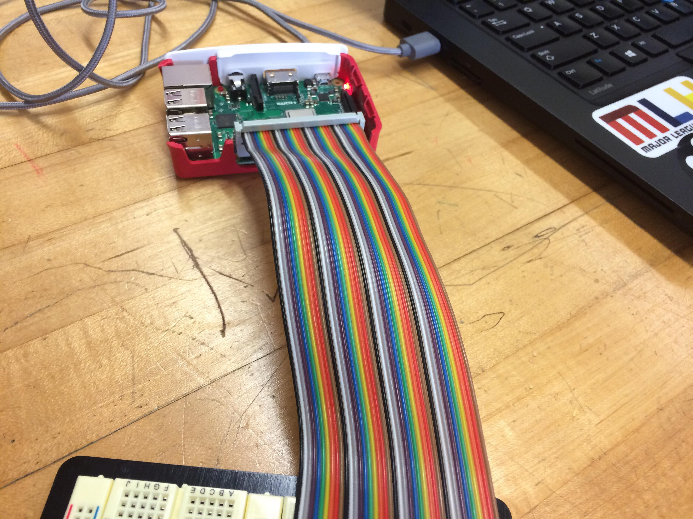
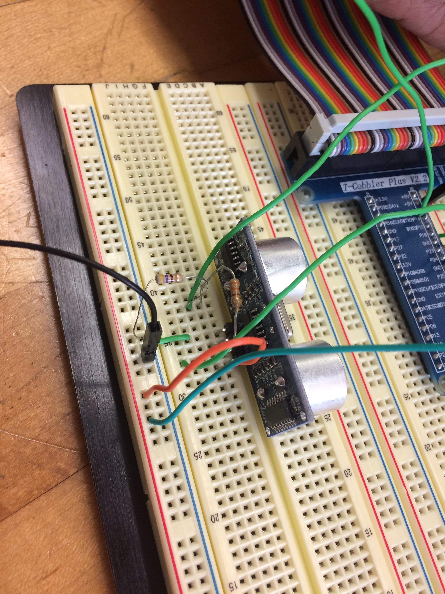
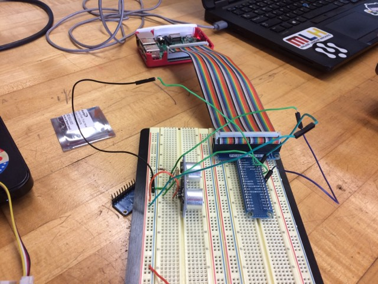

# P01: Danforth Restroom

**Author(s)**: John Martin and Lakshiya Indreswaran

**Google Document**: https://docs.google.com/document/d/1CMwVcBxFEZQUWYVB9HXuWjDuO-iIOJuK0ag4_DGn_NU/edit?usp=sharing

**Slide**: https://docs.google.com/presentation/d/122vHtJbB_v0fb2Yy0XkrNg1R2AguvYdLtDqi52bAyNg/edit?usp=sharing

**Critique sheet**: https://docs.google.com/document/d/1lNFKFpnQxEGQNzRpxQ5Byx-eO98_Qu6vBgQHg4Oob2g/edit?usp=sharing

---
## Purpose
The building has only one restroom for women and one for men. The main purpose of this embedded system is to find out whether or not 2 restrooms are enough. the system is going to record the time at which the doors of the restroom is open everyday. By processing the data we obtained, we can find out how often the restroom is used and whether more people have tried to use the restroom at the same time. using this data, we can find out whether or not 2 restroom is enough for the building. We came up with this idea when we found out that only two people can use the restroom at the same time and we thought what would happen if 3 or more people need to use the restroom at the same time.

## Initial Design Plan
- put ultrasonic range in door so that it records the number of times the door opens, and closes, and when it opens and closes. 

### Hardware Design
-  Ultrasonic range finder 

### Software Design
- List all of the classes and functions you'll be creating.
  - Your program must follow good coding standards. 
  Primarily, I mean your code should include meaningful functions 
  and appropriate variables, and be formatted and commented well. 
  - This is Python (not C), so *classes are expected* to be well-designed and used throughout.
  - Sloppy code with no structure will be penalized. 

This is an excellent place for a CRC card or two.

### Data Design
- Describe your data that will be saved on your device. In particular:
  - Describe the data itself (e.g., temperature), 
  - The frequency of the data saves (e.g., constant, minute, hour), 
  - The resolution of the data (e.g., calibrated, relative change)

A sample (i.e., table) of the data would likely make this section clearest.

## Files
N/A yet 

### Project Files
List every file in your repository, and briefly summarize each file's purpose in a sentence.

### Data Files
Also list your data files here, which will be due during Milestone 3. 

## Instructions
Explain how to use your product. 
This section should THOROUGHLY describe its usage (i.e., more than just "Push start").

## Errors and Constraints
*You'll complete this part at the end of the project.*

Every program has bugs. Use this section to create a bullet list of
all known errors and deficiencies that remain in your product. 
Also, list any constraints that must exist for your product to work 
(e.g., Only works in low light situations).

## References
- http://www.alarm.com/blog/what-is-contact-sensor?fbclid=IwAR0wLXL1i_-8fZY5sFXzOtyUfWmcgCotdjB-KuNnH5uzMZ9eSBmtrKG9KT8 - Explains what a contact sensor is and does.
- https://www.raspberrypi.org/forums/viewtopic.php?t=58267&fbclid=IwAR3LjHfLkEAg3tJspgcGtCCLHWUZ8sC3iMh90MkhtngXUU6XxfuG7DN1P3c -
sensor for Rasberry PI. 
- https://tutorials-raspberrypi.com/raspberry-pi-ultrasonic-sensor-hc-sr04/ - Helper code for ultrasound 
- http://codelectron.com/measure-distance-ultrasonic-sensor-pi-hc-sr04/ - Helper code for the ultrasound

## Summary and Reflection
*You'll complete this part at the end of the project.*

Write 3 - 5 paragraphs on your reactions to the final project. 
Your reflection should be thoughtful and reflective. 
First, report on what you did. Then, reflect on those actions. 
It's a look back at what you learned by doing this project, but good and bad. 
You should be critical of shortcomings (yours, as well as the instructors/assignments) 
as well as celebratory of what was achieved.

## Final Self-Evaluations
*You'll complete this part at the end of the project. 
Assign points to each team member in each category, based on their contribution to the team. 
The sum of all member's points in each category cannot exceed 10. 
For example, for Coding, Partner 1 could get 7 points, and Partner 2 gets 3 points. 
You can't give both people 6 points each though, as the sum exceeds 10.

### Ideation, Brainstorming, Design:

*Partner 1 (replace this with your name): 0-10*

*Partner 2 (replace this with your name): 0-10*

### Code creation: 

*Partner 1 (replace this with your name): 0-10*

*Partner 2 (replace this with your name): 0-10*

### Documentation creation:

*Partner 1 (replace this with your name): 0-10*

*Partner 2 (replace this with your name): 0-10*

### Teamwork & Participation:

*Partner 1 (replace this with your name): 0-10*

*Partner 2 (replace this with your name): 0-10*

---
**A Note from Scott to You**

While I expect this project to be challenging, one
thing to keep in mind is HAVE FUN with it! Create a product that
expresses your personal interests. Break up the writing so it’s not so burdensome.
We will have a live demo sessions at the end of the project to celebrate your accomplishments.
