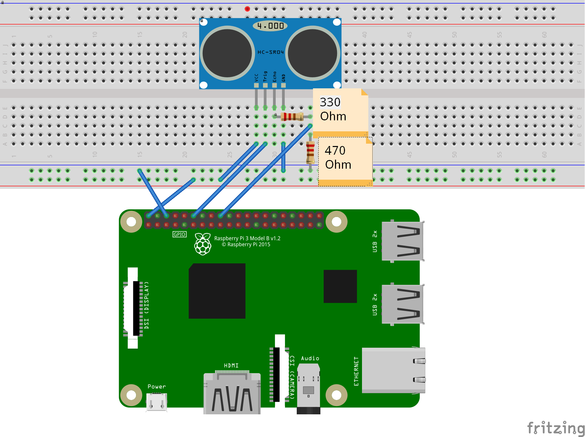
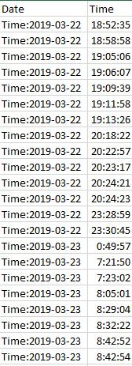

# P01: Danforth Restroom

**Author(s)**: John Martin and Lakshiya Indreswaran

**Google Document**: https://docs.google.com/document/d/1CMwVcBxFEZQUWYVB9HXuWjDuO-iIOJuK0ag4_DGn_NU/edit?usp=sharing

**Slide**: https://docs.google.com/presentation/d/122vHtJbB_v0fb2Yy0XkrNg1R2AguvYdLtDqi52bAyNg/edit?usp=sharing

**Critique sheet**: https://docs.google.com/document/d/1lNFKFpnQxEGQNzRpxQ5Byx-eO98_Qu6vBgQHg4Oob2g/edit?usp=sharing

---
## Purpose
The building has only one restroom for women and one for men. The main purpose of this embedded system is to find out whether or not 2 restrooms are enough. the system is going to record the time at which the doors of the restroom is opened everyday. By processing the data we obtained, we can find out how often the restroom is used and whether more people have tried to use the restroom at the same time. using this data, we can find out whether or not 2 restroom is enough for the building. We came up with this idea when we found out that only two people can use the restroom at the same time and we thought what would happen if 3 or more people need to use the restroom at the same time.

## Initial Design Plan
- put ultrasonic range near door so that it records the number of times the door opens, and closes, and record when(the tiem at which) it opens and closes. 

### Hardware Design
-  Ultrasonic range finder 

### Software Design
- List all of the classes and functions you'll be creating.
  
  1.Classes
    Class ProjectTwo :We only created one class because our program only have two functions, so we did not have a necessasity to create many classes. 
    
 2. Function
     def __init__(self) :This is the constructor for the class. Variables are defined here and csv file is created here
     def __init__(self) : this is the function in which the distance that the ultrasonic waves have travelled is recorded for every 8 seconds
     def __init__(self) : this is the function which stores the data in the csv file if the distance teh ultra sonic waves travelled is less than 89cm
     def __init__(self) : This is the main function

### Data Design
- We will be saving date and time. 
  - The date is recorded through in the format 00/00/0000, and the Time is formated in military time containging milliseconds. 
  - The data is saved constantly.
  - The data is collected every .8 of a second, in order to match speed people usually walk into and out of the restroom. 

## Files
indreswaranl.py : This is our final code which contains class and which can save the data in the csv file(Excel file)

### Project Files
List every file in your repository, and briefly summarize each file's purpose in a sentence.

### Data Files
-Data File 0 - file of all the data we collected for today 
-Data File 1 - file of better data range with text description
-Data File 2 - filtered data that will actually be stored with out time and Date
-DataFromThreeDays- contains data of Date  and time for multiple days is a little unordered 

## Instructions
In order to use the project you must open the Pi using the VNC Viewer, then you need to find the file. 

## Errors and Constraints
- saves data in a text file, and not in an excell file 
- time is not perfect off by 45 mins/sec, but only because the Pi is not set to the right time
- only in millitary time

## References
- http://www.alarm.com/blog/what-is-contact-sensor?fbclid=IwAR0wLXL1i_-8fZY5sFXzOtyUfWmcgCotdjB-KuNnH5uzMZ9eSBmtrKG9KT8 - Explains what a contact sensor is and does.
- https://www.raspberrypi.org/forums/viewtopic.php?t=58267&fbclid=IwAR3LjHfLkEAg3tJspgcGtCCLHWUZ8sC3iMh90MkhtngXUU6XxfuG7DN1P3c -
sensor for Rasberry PI. 
- https://tutorials-raspberrypi.com/raspberry-pi-ultrasonic-sensor-hc-sr04/ - Helper code for ultrasound 
- http://codelectron.com/measure-distance-ultrasonic-sensor-pi-hc-sr04/ - Helper code for the ultrasound
- https://l.facebook.com/l.php?u=https%3A%2F%2Fgist.github.com%2Feyllanesc%2Ff8464b57e091777a5aef48fdd9ea9067%3Ffbclid%3DIwAR0QoE82GmPyv_7anRkpnVWzS5Ou3mkrzTmE2gUuVqXQhOMg85XrXyVFdxo&h=AT39olit3he9SBpNUenUnW_fYhJsIkAxLDxeKqyxoVAIyOACI_A2Ev8tKKI7JooX6E1i_ZzkjOkiuV2jp_DyE2TG-LeV1W9MogiGYTNzR0k2BggZhG6js5JuuT_xo01vsJuodw - Helper code that works for the Ultrasonic 

## Summary and Reflection
  This project was a lot, but I enjoyed it. It was more focused on storing the data, and I think we did a pretty ok job. At first our data was formatted in a way that would allow us to analize it easily, but we eventually changed this. There is also a problem that arised where my Raspberry Pi completely broke, and all of our code was on there, but eventually we were able to save the code whic was stored on the SD card using another Raspberry Pi. This experience taught me the importance of saving the data constantly, and in more than one place. 
   In this project we made the Ultrasoic record when someone walks into the restroom using a distance of below 89cm near the restroom door. It was challenging, but fun. It took some time to handle for Date and time, and to find code that worked with the ultrasonic on the Raspberry Pi. It also was challenging to get the file to write the information we needed in a format that would make the data easy to analyze. Eventually we were able to make code that did all of these things. 
   I learned a lot from this experience. I learned how to use a Raspberry Pi, I learned about digital and analog data, I learned how the Ultrasonic Range Finder acutally works. Not everything was completed as well as I would have liked it to be, but I enjoyed the process of making it happen. I also enjoyed completing my project to this point. Next time I would spend more time on the code itself, specifically trying to find a better way to save the data. 

## Final Self-Evaluations
*You'll complete this part at the end of the project. 
Assign points to each team member in each category, based on their contribution to the team. 
The sum of all member's points in each category cannot exceed 10. 
For example, for Coding, Partner 1 could get 7 points, and Partner 2 gets 3 points. 
You can't give both people 6 points each though, as the sum exceeds 10.

### Ideation, Brainstorming, Design:

*Partner 1 (replace this with your name): 0-10*

*Partner 2 (replace this with your name): 0-10*

### Code creation: 

*Partner 1 (replace this with your name): 0-10*

*Partner 2 (replace this with your name): 0-10*

### Documentation creation:

*Partner 1 (replace this with your name): 0-10*

*Partner 2 (replace this with your name): 0-10*

### Teamwork & Participation:

*Partner 1 (replace this with your name): 0-10*

*Partner 2 (replace this with your name): 0-10*

---
**A Note from Scott to You**

While I expect this project to be challenging, one
thing to keep in mind is HAVE FUN with it! Create a product that
expresses your personal interests. Break up the writing so it’s not so burdensome.
We will have a live demo sessions at the end of the project to celebrate your accomplishments.
