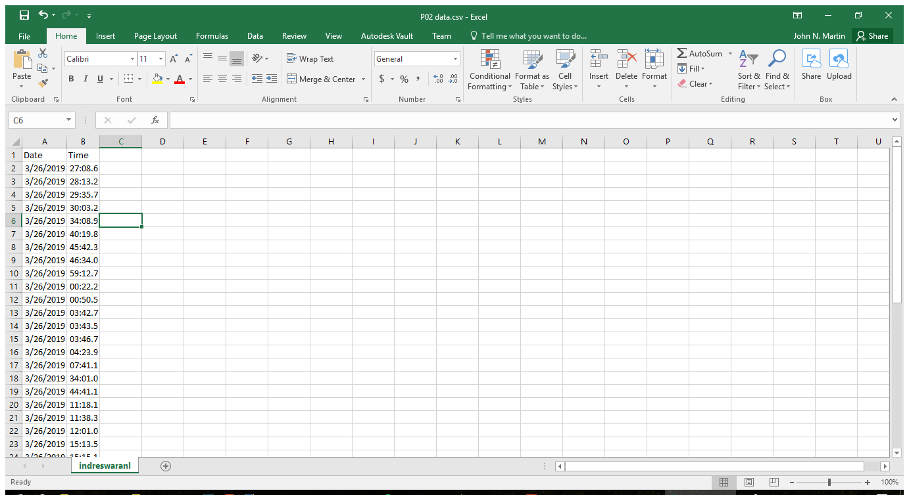

# P01: Danforth Restroom

**Author(s)**: John Martin and Lakshiya Indreswaran

**Google Document**: https://docs.google.com/document/d/1CMwVcBxFEZQUWYVB9HXuWjDuO-iIOJuK0ag4_DGn_NU/edit?usp=sharing

**Slide**: https://docs.google.com/presentation/d/122vHtJbB_v0fb2Yy0XkrNg1R2AguvYdLtDqi52bAyNg/edit?usp=sharing

**Critique sheet**: https://docs.google.com/document/d/1lNFKFpnQxEGQNzRpxQ5Byx-eO98_Qu6vBgQHg4Oob2g/edit?usp=sharing

---
## Purpose
The building has only one restroom for women and one for men. The main purpose of this embedded system is to find out whether or not 2 restrooms are enough. the system is going to record the time at which the doors of the restroom is opened everyday. By processing the data we obtained, we can find out how often the restroom is used and whether more people have tried to use the restroom at the same time. using this data, we can find out whether or not 2 restroom is enough for the building. We came up with this idea when we found out that only two people can use the restroom at the same time and we thought what would happen if 3 or more people need to use the restroom at the same time.

## Initial Design Plan
- put ultrasonic range near door so that it records the number of times the door opens, and closes, and record when(the tiem at which) it opens and closes. 

### Hardware Design
-  Ultrasonic range finder 

### Software Design
- List all of the classes and functions you'll be creating.
  
  1.Classes
    Class ProjectTwo :We only created one class because our program only have two functions, so we did not have a necessasity to create many classes. 
    
 2. Function
     def __init__(self) :This is the constructor for the class. Variables are defined here and csv file is created here

     def __init__(self) : this is the function in which the distance that the ultrasonic waves have travelled is recorded for every 8 seconds

     def __init__(self) : this is the function which stores the data in the csv file if the distance teh ultra sonic waves travelled is less than 89cm

     def __init__(self) : This is the main function

### Data Design
- We will be saving date and time. 
  - The date is recorded through in the format 00/00/0000, and the Time is formated in military time containging milliseconds. 
  - The data is saved constantly.
  - The data is collected every .8 of a second, in order to match speed people usually walk into and out of the restroom. 

## Files
indreswaranl.py : This is our final code which contains class and which can save the data in the csv file(Excel file)

### Project Files
P02 data.csv : This is the data file which shows how data is currently stored in the project

indreswaranl.py : This is our final code which contains class and can save the data in the csv file(Excel file) format.

P02image.png : the hardware design

### Data Files
-Data File 0 - file of all the data we collected for today 

-Data File 1 - file of better data range with text description

-Data File 2 - filtered data that will actually be stored with out time and Date

-DataFromThreeDays- contains data of Date  and time for multiple days is a little unordered 

## Instructions
In order to use the project you must open the Pi using the VNC Viewer, then run the code and an excel file will be created and we can check the data stored in the excel file. The program uses an ultrasonic sensor which continuously emit or send ultra sonic waves. when the waves hit an object, the echo is sent back and the time taken to hit the object is calculated and using the time difference(time taken to receive the echo back), the distance is calculated. 
  
  In our project, we placed the pi and the sensors infront of the females restroom near the door in the Danforth Technology Building. There is a wall opposite to the sensor. Thus the distance meausred by the sensor is nearly 97 cm. If a person enter the restroom then the ultra sonic wave will not reach the wall, but reach the person and send the echo back. 
  
  We meausred the distance between the door and the sensor and considering the door in that restroom can not be opened by pusing in the farend, we decided that if the distance calculated by the sensor is less than 89cm, then there is a movement which is mostly due to the entry into the restroom or out from the restroom. The sensor saves the data everytime the distance is less than 89 cm. In order to calculate the number of people who used or tried to use the restroom we will be dividing the total number of data stored in a day by 2 after removing the outliers when we analyze the data. This project can be used to determine how often the restroom has been used.

## Errors and Constraints
  We faced some challeneges and had some errors in the data we collceted due to the challenges. We wanted to place the sensors right behind the door and inside the restroom so that the data we collect is more accurate and it does not record while the door is opened. This way we can filter the data using the distance between the door and the sensors and people who tried to come into the restroom as well. But we could not place the sensors inside the restroom for various reasons which include, insufficient space, inavailabilty of the power outlet. As a result we placed the sensors/pi infront of the women's restroom. The probelm we faced is that the room next to the restroom has a door which could open wide and would intrupt the ulstrsonic waves. This means that everytime the door is opened in such a way that it covers the restroom door, the data that was enetered is not useful. It is an error. 

  Another problem we are facing is that of someone stands infront of the sensor for long time, it record it as a multiple entry. Eventhough it is an error in storing the data, this can be resolved while analyzing the data. These data can be removed based on the time it corresponds to. Since the time recorded include milliseonds, we can easily eliinate those multiple entry. Due to the structure of the restroom while one person enter the restroom, another person can not exit at the same time. Therefore this error can be elimintaed while anlayzing the data. Another defect that our code has is that the time of our pi is off by 1 minute. It shows an incorrect time. We could easily fix it but for now, we did not fix it so that data collection is not interupted.

## References
- http://www.alarm.com/blog/what-is-contact-sensor?fbclid=IwAR0wLXL1i_-8fZY5sFXzOtyUfWmcgCotdjB-KuNnH5uzMZ9eSBmtrKG9KT8 - Explains what a contact sensor is and does.
- https://www.raspberrypi.org/forums/viewtopic.php?t=58267&fbclid=IwAR3LjHfLkEAg3tJspgcGtCCLHWUZ8sC3iMh90MkhtngXUU6XxfuG7DN1P3c -
sensor for Rasberry PI. 
- https://tutorials-raspberrypi.com/raspberry-pi-ultrasonic-sensor-hc-sr04/ - Helper code for ultrasound 
- http://codelectron.com/measure-distance-ultrasonic-sensor-pi-hc-sr04/ - Helper code for the ultrasound
- https://l.facebook.com/l.php?u=https%3A%2F%2Fgist.github.com%2Feyllanesc%2Ff8464b57e091777a5aef48fdd9ea9067%3Ffbclid%3DIwAR0QoE82GmPyv_7anRkpnVWzS5Ou3mkrzTmE2gUuVqXQhOMg85XrXyVFdxo&h=AT39olit3he9SBpNUenUnW_fYhJsIkAxLDxeKqyxoVAIyOACI_A2Ev8tKKI7JooX6E1i_ZzkjOkiuV2jp_DyE2TG-LeV1W9MogiGYTNzR0k2BggZhG6js5JuuT_xo01vsJuodw - Helper code that works for the Ultrasonic 

## Summary and Reflection

## Final Self-Evaluations

### Ideation, Brainstorming, Design:

*Partner 1 (replace this with your name): 0-10*

*Partner 2 (replace this with your name): 0-10*

### Code creation: 

*Partner 1 (replace this with your name): 0-10*

*Partner 2 (replace this with your name): 0-10*

### Documentation creation:

*Partner 1 (replace this with your name): 0-10*

*Partner 2 (replace this with your name): 0-10*

### Teamwork & Participation:

*Partner 1 (replace this with your name): 0-10*

*Partner 2 (replace this with your name): 0-10*

---
**A Note from Scott to You**

While I expect this project to be challenging, one
thing to keep in mind is HAVE FUN with it! Create a product that
expresses your personal interests. Break up the writing so it’s not so burdensome.
We will have a live demo sessions at the end of the project to celebrate your accomplishments.
